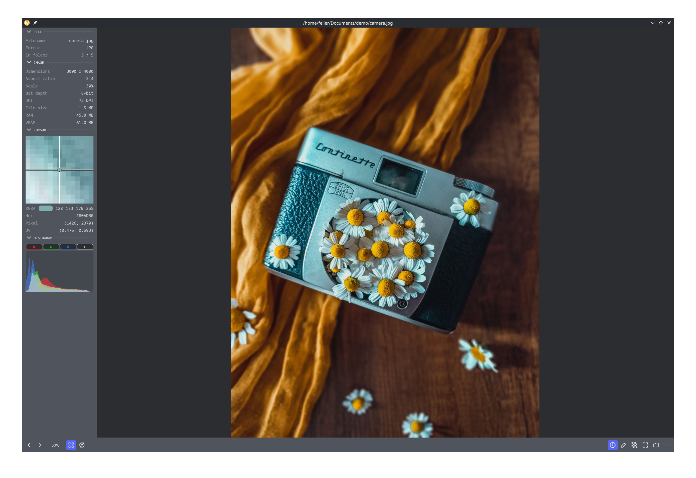

<div align="center">
  <a href="https://github.com/nnmarcoo/bloom/releases/latest"></a>
  <br><br>
  <p><em>hardware-accelerated media viewer built with Rust</em></p>

  
  
  
</div>

<div align="center"></div>

---

## Features

- **GPU rendering** — hardware-accelerated via [wgpu](https://wgpu.rs) at any resolution
- **Hardware mipmaps** — smooth zoomed-out views
- **GIF, APNG & WebP** — animation playback with timeline scrubbing and frame controls
- **Video** — MP4, MOV, MKV, WebM, AVI and more with audio, scrubbing, and frame stepping
- **Gallery** — browse every image in a folder
- **Tiled textures** — handles images larger than GPU texture limits
- **Pan and zoom** — 0.01× to 35×, with custom % input
- **Non-destructive modifiers** — brightness/contrast, exposure, hue/saturation, vibrance, color balance, levels, vignette, grain, chromatic aberration, halftone, posterize, threshold, and more
- **Export** — PNG, JPEG, or WebP with crop, rotation, and modifiers applied
- **Clipboard import** — load an image from clipboard or file path
- **Drag and drop** — drop any supported file onto the window
- **Info panel** — metadata, dimensions, EXIF, pixel color under cursor, RGB histogram, and animation timing
- **Rotation** — 90° clockwise or counter-clockwise
- **Checkerboard toggle** — visualize transparency
- **Context menu** — right-click to copy pixel color or file path
- **Themes** — 22 built-in, including Catppuccin, Tokyo Night, Nord, Dracula, Gruvbox, and Kanagawa
- **Customizable keybindings** — rebind any action in preferences

## Supported Formats

<table align="center">
  <thead>
    <tr><th>Format</th><th>Extension</th><th>Notes</th></tr>
  </thead>
  <tbody>
    <tr><td>Animated PNG</td><td><code>.apng</code></td><td>Animated</td></tr>
    <tr><td>Apple Icon</td><td><code>.icns</code></td><td>Largest available size</td></tr>
    <tr><td>BMP</td><td><code>.bmp</code></td><td></td></tr>
    <tr><td>DDS</td><td><code>.dds</code></td><td>BC1–BC7 and uncompressed</td></tr>
    <tr><td>DICOM</td><td><code>.dcm</code> <code>.dicom</code></td><td>Medical imaging, first frame</td></tr>
    <tr><td>EPS / PostScript</td><td><code>.eps</code> <code>.ps</code> <code>.epsf</code></td><td>Requires Ghostscript on PATH</td></tr>
    <tr><td>Farbfeld</td><td><code>.ff</code></td><td></td></tr>
    <tr><td>FITS</td><td><code>.fits</code> <code>.fit</code> <code>.fts</code></td><td>Astronomy imaging; linear normalized to greyscale</td></tr>
    <tr><td>GIF</td><td><code>.gif</code></td><td>Animated</td></tr>
    <tr><td>GIMP</td><td><code>.xcf</code></td><td>Layers composited top-to-bottom</td></tr>
    <tr><td>HDR (Radiance)</td><td><code>.hdr</code></td><td>Tonemapped (Reinhard)</td></tr>
    <tr><td>HEIC / HEIF</td><td><code>.heic</code> <code>.heif</code></td><td>In default/<code>-heif</code> downloads; <code>--features heif</code> from source</td></tr>
    <tr><td>ICO</td><td><code>.ico</code></td><td>Largest available size</td></tr>
    <tr><td>JPEG</td><td><code>.jpg</code> <code>.jpeg</code></td><td></td></tr>
    <tr><td>JPEG 2000</td><td><code>.jp2</code> <code>.j2k</code> <code>.j2c</code> <code>.jpx</code></td><td></td></tr>
    <tr><td>JPEG XL</td><td><code>.jxl</code></td><td></td></tr>
    <tr><td>Krita</td><td><code>.kra</code></td><td>Merged composite, no layers</td></tr>
    <tr><td>KTX2</td><td><code>.ktx2</code></td><td>Basis Universal and uncompressed</td></tr>
    <tr><td>OpenEXR</td><td><code>.exr</code></td><td>Tonemapped (Reinhard)</td></tr>
    <tr><td>Photoshop</td><td><code>.psd</code> <code>.psb</code></td><td>Merged composite, no layers</td></tr>
    <tr><td>PNG</td><td><code>.png</code></td><td></td></tr>
    <tr><td>Portable bitmap</td><td><code>.pbm</code> <code>.pgm</code> <code>.ppm</code></td><td></td></tr>
    <tr><td>QOI</td><td><code>.qoi</code></td><td></td></tr>
    <tr><td>RAW</td><td><code>.ari</code> <code>.arw</code> <code>.cr2</code> <code>.cr3</code> <code>.crm</code> <code>.crw</code> <code>.dcr</code> <code>.dcs</code> <code>.dng</code> <code>.erf</code> <code>.fff</code> <code>.iiq</code> <code>.kdc</code> <code>.mef</code> <code>.mos</code> <code>.mrw</code> <code>.nef</code> <code>.nrw</code> <code>.orf</code> <code>.ori</code> <code>.pef</code> <code>.qtk</code> <code>.raf</code> <code>.raw</code> <code>.rwl</code> <code>.rw2</code> <code>.srw</code> <code>.x3f</code> <code>.3fr</code></td><td>Camera RAW; not all models supported</td></tr>
    <tr><td>SVG</td><td><code>.svg</code> <code>.svgz</code></td><td>Rasterized at native size</td></tr>
    <tr><td>TGA</td><td><code>.tga</code></td><td></td></tr>
    <tr><td>TIFF</td><td><code>.tif</code> <code>.tiff</code></td><td>No 64-bit float</td></tr>
    <tr><td>Video</td><td><code>.mp4</code> <code>.m4v</code> <code>.mov</code> <code>.mkv</code> <code>.webm</code> <code>.avi</code> <code>.mpg</code> <code>.mpeg</code> <code>.ts</code> <code>.m2ts</code> <code>.wmv</code> <code>.flv</code></td><td>Playback with audio; in the default download or <code>--features av</code> from source</td></tr>
    <tr><td>WebP</td><td><code>.webp</code></td><td>Static and animated</td></tr>
  </tbody>
</table>

## Download

Prebuilt [releases](https://github.com/nnmarcoo/bloom/releases/latest) come in three flavors per platform — pick based on which formats you need:

| Download | Includes | Size |
| --- | --- | --- |
| `bloom-<platform>` | Everything, including HEIC/HEIF and video | Largest |
| `bloom-<platform>-heif` | Core formats + HEIC/HEIF, no video | Smaller |
| `bloom-<platform>-minimal` | Core formats only | Smallest |

Video is the bulk of the size (it bundles FFmpeg), so grab `-heif` or `-minimal` if you don't need it.

## Build

> The feature flags below only matter when building from source — prebuilt downloads above already include them.

```sh
cargo build --release
```

For HEIC/HEIF support, install libheif and build with the feature flag:

```sh
# macOS
brew install libheif

# Linux
sudo apt install libheif-dev   # Ubuntu/Debian
sudo dnf install libheif-devel # Fedora
sudo pacman -S libheif         # Arch

cargo build --release --features heif
```

For video playback, the `ffmpeg-next` bindings link against FFmpeg. A helper script installs it:

```sh
# macOS / Linux
./scripts/setup-av.sh

# Windows (PowerShell) — downloads a prebuilt FFmpeg into vendor/ and sets FFMPEG_DIR
./scripts/setup-av.ps1

cargo build --release --features av
```

On Linux the script installs the FFmpeg dev libraries via your system package manager (`libavformat-dev`, `libavfilter-dev`, `libavdevice-dev`, `libclang-dev` on Ubuntu/Debian; `ffmpeg-devel clang` on Fedora; `ffmpeg clang` on Arch). On Windows it fetches a prebuilt shared FFmpeg into `vendor/ffmpeg`, sets `FFMPEG_DIR`, adds the DLLs to your `PATH`, and installs LLVM via winget (needed for `ffmpeg-sys-next`'s bindgen step) — open a new terminal afterward so the environment changes take effect.

Requires a GPU with WebGPU support. On Windows, DX12 is used by default.

## Privacy

Bloom is entirely local. No telemetry, no analytics, no network requests — ever. Your files stay on your machine.
